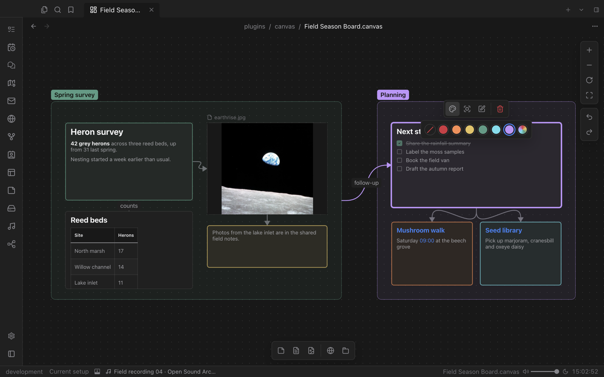

# Canvas

An infinite board for thinking visually. Arrange text, notes, images, media and web pages as cards, group them, connect them and see how your ideas fit together.

## Cards for everything

- **Text cards** with full Markdown: headings, tables, checklists and links.
- **File cards** for notes, images, PDFs, audio and video, shown with Valley's own viewers.
- **Web cards** for pages you want to keep in view.
- **Groups** with labels and colours to structure the board.

## Connect your thinking

Draw connections between cards, label them and colour them. Pan and zoom freely, fit the board to the screen, and undo any change.

Select a card to colour, focus, edit or remove it from a small floating toolbar. The creation toolbar at the bottom adds new cards in one click.

## Open format

Boards are saved as JSON Canvas `.canvas` files in your vault, so they stay readable and portable.
